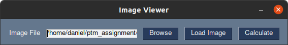
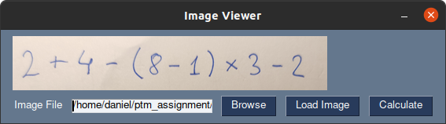
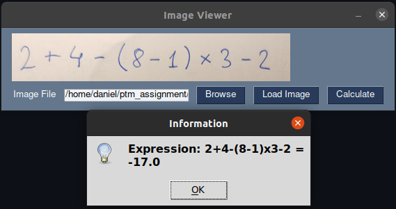
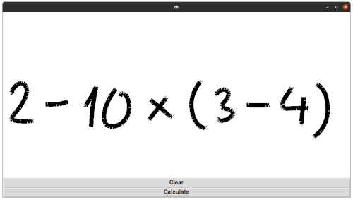
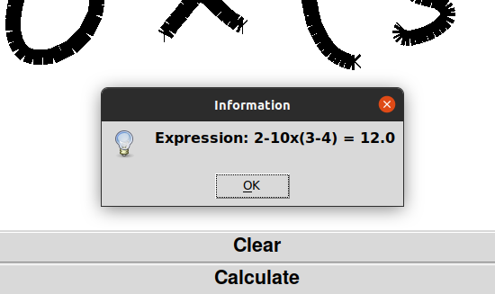
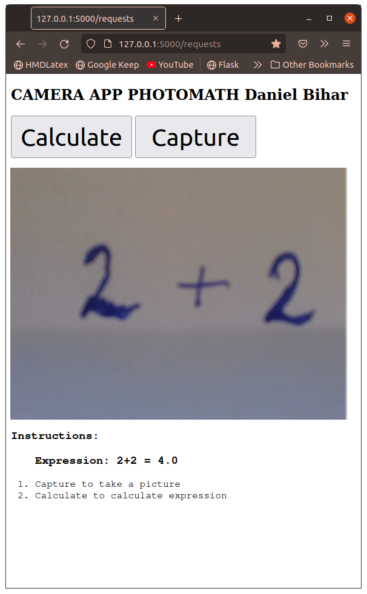

# Photomath assignment Daniel Bihar

This project consists of three interfaces to our simple visual expression calculator. 
Interfaces include:
1) A GUI image loader in executable script "image_gui_loader.py"
2) A GUI drawing app input in executable script "draw.py"
3) A Web Flask app in executable script "flask_camera.py"

## Running standalone GUI apps

### Installing requirements:

	$ pip3 install -r requirements.txt
	$ pip3 install tensorflow==2.7.0
	$ apt-get install python3-tk
	
### Image loader GUI:

	$ python3 image_gui_loader.py
	
	Result will be shown in a messagebox

### Draw GUI:

	$ python3 draw.py
	
	Result will be shown in a messagebox
	

### Web app:

	$ python3 flask_camera.py
	
	Then open http://127.0.0.1:5000/
	
	Result will be shown on the bottom of the web page
	

	
## Running modules from command line

### Character separator module:

Character separator take one string argument which is path to image, and saves cropped output in folder "./Characters"

	$ python3 character_separator.py ./shots/shot_canvas.png
	
### Character classifier module:

Character classifier takes images from "./Characters" folder and prints prediction in commandline

	$ python3 character_classifier_detect.py

### Expression module:

Expression module takes string as first positional argument and evaluates it. Allowed characters are 0-9, +, *, -, /, (, )

	$ python3 expression_calculator.py "2 + 3 - ( 9 * 2 ) / 2 - ( 7 - 20 )"

## Training data download and training model
Training of the new model is as easy as running:
	
	$ python3 character_classifier_train.py
	
Training data needs to be in folder data, while our dataset can be obtained at:

	google_link

## Docker

### Building docker image:
Build docker image with Dockerfile:

	$ sudo docker build -t docker-pmt-daniel .
	$ sudo chmod 666 /var/run/docker.sock
	
## Downloading docker image:

	
## Running from docker container

Non GUI scripts you can run using (only change script name at the end):
	
	$ docker run -it --rm docker_pmt_daniel python3 /photomath/expression_calculator.py "2+2"

Now you can run all GUI scripts using (just replace name of the script at the end):
	
	$ docker run -it -e DISPLAY=$DISPLAY -v /tmp/.X11-unix:/tmp/.X11-unix:rw -v $(pwd)/app:/app --rm docker_pmt_daniel python3 /photomath/draw.py
	
	
## PS.

Since this project is quick prototype, I tried to fit as much functionality in as little code possible. That's why the code is functional in nature and not o.o. so that we can avoid unnecessary abstraction. All scripts are connected trough "main. py" and links to dataset is provided. The project has been developed in master branch contrary to usual M.O.
